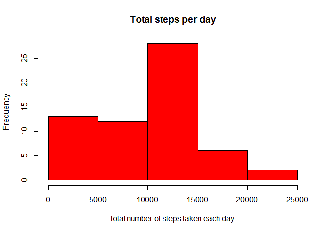
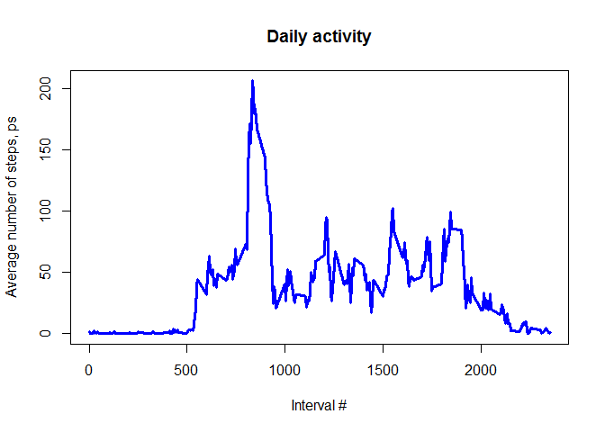
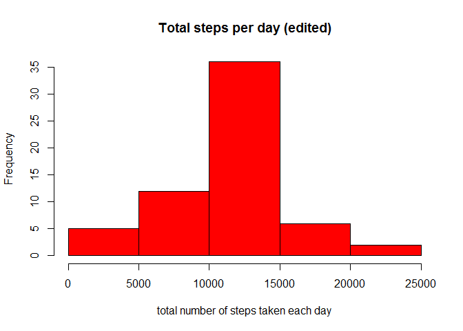
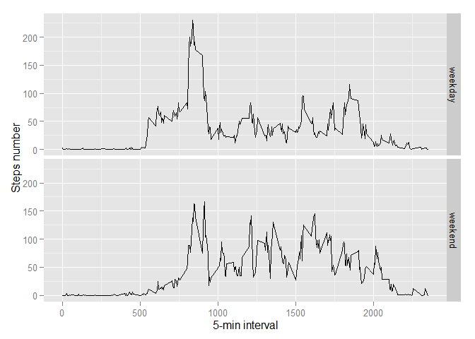

# Reproducible Research: Peer Assessment 1
ABRAMOV Andrey  
Sunday, March 20, 2016  

###Please change the working directories at line 12!

```r
  setwd("F:/100")
```

## Loading and preprocessing the data
Loading and preprocessing the data

Show any code that is needed to

1. Load the data
2. Process/transform the data (if necessary) into a format suitable for your analysis


```r
# load all set of libraryes
library(dplyr)
```

```
## 
## Attaching package: 'dplyr'
```

```
## The following object is masked from 'package:stats':
## 
##     filter
```

```
## The following objects are masked from 'package:base':
## 
##     intersect, setdiff, setequal, union
```

```r
library(lattice)
library(tidyr)
library(lubridate)
library(ggplot2)

if(!file.exists("activity.csv")){
  unzip("activity.zip")
}
activity<-read.csv("activity.csv" )
```


## What is mean total number of steps taken per day?
For this part of the assignment, you can ignore the missing values in the dataset.

1. Calculate the total number of steps taken per day
2. If you do not understand the difference between a histogram and a barplot, 
research the difference between them. 
Make a histogram of the total number of steps taken each day
3. Calculate and report the mean and median of the total number of 
steps taken per day

Mean and median number of steps taken each day

```r
activity <- transform(activity, date = factor(date))
activity.steps <- tapply(activity$steps, activity$date, FUN=sum, na.rm=TRUE)
activity.mean <- mean(activity.steps, na.rm=TRUE)
activity.median <- median(activity.steps, na.rm=TRUE)
```
Mean number of steps taken each day is 9354.2295082.  
Median number of steps taken each day is 10395.
Note that the data contains NAs.These NAs are not replaced by “0”, 
but data points are not considered for mean/median calculations and in the histogram.

Histogram of total steps taken per day

```r
hist(activity.steps, main = "Total steps per day", 
    xlab = "total number of steps taken each day", ylab = "Frequency",
    col="red")
```




## What is the average daily activity pattern?
1. Make a time series plot of the 5-minute interval 
(x-axis) and the average number of steps taken, averaged across all days (y-axis)
2. Which 5-minute interval, on average across all the days in the dataset, 
contains the maximum number of steps?

Transform the loaded activity data:

```r
activity <-transform(activity, interval = factor(interval))
#activity <-na.omit(activity)
activity<-group_by(activity,interval)
mean_interval <- summarise(activity, steps = mean(steps,na.rm=TRUE))
```

And plot the averaged steps per interval:

```r
plot(levels(as.factor(mean_interval$interval)), mean_interval$steps, 
     type="l", col="blue", lwd=3, 
     main="Daily activity", 
     xlab="Interval #", ylab="Average number of steps, ps")
```



Then 5-minute interval with maximum number of average steps will be 

```r
max_5min.steps<-mean_interval[match(max(mean_interval$steps),mean_interval$steps),]
```

Interval 835 contains the maximum steps. 
On average across all the days - 206  steps are taken.

## Imputing missing values

Note that there are a number of days/intervals where there are missing values. The presence of missing days may introduce bias into some calculations or summaries of the data.

1. Calculate and report the total number of missing values in the dataset 

```r
missing<-sum(is.na(activity))
```
The total number of NAs in the monitoring data set is 2304. It's about 
13 %  compared to the whole data set is .


2. Devise a strategy for filling in all of the missing values in the dataset. The strategy does not need to be sophisticated. For example, you could use the mean/median for that day, or the mean for that 5-minute interval, etc.
3. Create a new dataset that is equal to the original dataset but with the missing data filled in.

```r
add.value <- function(steps, interval) {
    filled <- NA
    if (!is.na(steps)) {filled <- c(steps) }
    else {filled <- (averages[averages$interval==interval, "steps"]) }
    return(filled)
}
data <- activity
averages <- aggregate(x=list(steps=data$steps), by=list(interval=data$interval), FUN=mean, na.rm=TRUE)
data$steps <- mapply(add.value, data$steps, data$interval)
```

4. Make a histogram of the total number of steps taken each day and Calculate and report the mean and median total number of steps taken per day. Do these values differ from the estimates from the first part of the assignment? What is the impact of imputing missing data on the estimates of the total daily number of steps?

```r
total.steps <- tapply(data$steps, data$date, FUN=sum)
hist(total.steps, main = "Total steps per day (edited)", 
    xlab = "total number of steps taken each day", ylab = "Frequency",
    col="red")
```



```r
activity.mean2 <- mean(total.steps)
activity.median2 <- median(total.steps)
```
Mean number of steps taken each day is higher than precious one: 10766 / 9354.  
Median number of steps taken each day is higher too: 10766 / 10395.  
The reason is that in the original data, there are some days with "steps" values "NA" for any "interval". 
The total number of steps taken in such days are set to 0s by default. 

## Are there differences in activity patterns between weekdays and weekends?


```r
week.days <- function(date) {
    day <- weekdays(date)
    if (day %in% c("Monday", "Tuesday", "Wednesday", "Thursday", "Friday"))  return("weekday")
    else if (day %in% c("Saturday", "Sunday")) return("weekend")
    else stop("wrong date")
}
Sys.setlocale(category = "LC_TIME", locale = "C") # English weekday names in a plot
```

```
## [1] "C"
```

```r
Sys.setenv(LANGUAGE='en')
data$date <- as.Date(data$date)
data$day <- sapply(data$date, FUN=week.days)
```

Make a panel plot containing a time series plot of the 5-minute interval (x-axis) and the average number of steps taken, averaged across all weekday days or weekend days (y-axis). 

```r
average.number <- aggregate(steps ~ interval + day, data=data, mean)
average.number$interval <- as.numeric(as.character(average.number$interval))
ggplot(average.number, aes(interval, steps)) + geom_line() + facet_grid(day ~ .) +
    xlab("5-min interval") + ylab("Steps number") +
    scale_x_continuous(breaks = round(seq(min(average.number$interval), 
                                          max(average.number$interval), by = 500),1))
```



```r
average.number.peak<-average.number[which(average.number$steps==max(average.number$steps)), ]
```


The figures show different daily activity patterns for weekdays and the weekend. During weekdays most activities are in the morning with peak at 835 with the average steps of 230. The activity on weekends starts later and ends later. The number of steps are more smooth for the entire day.
